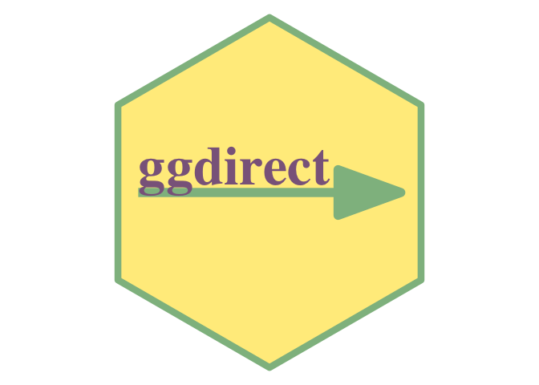
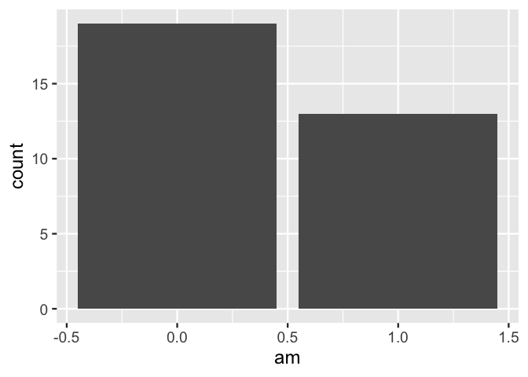
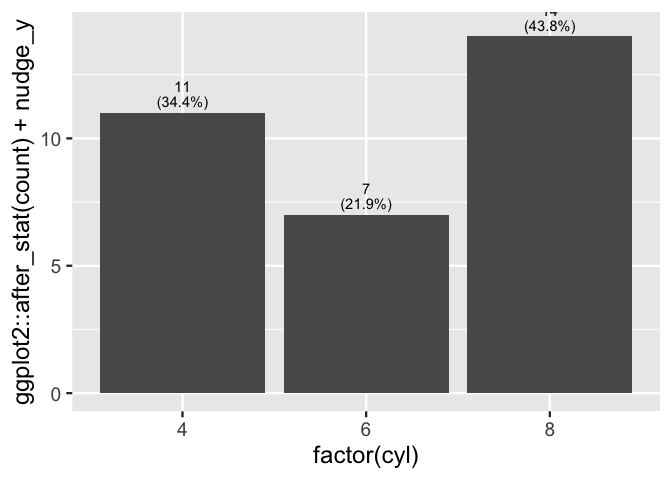
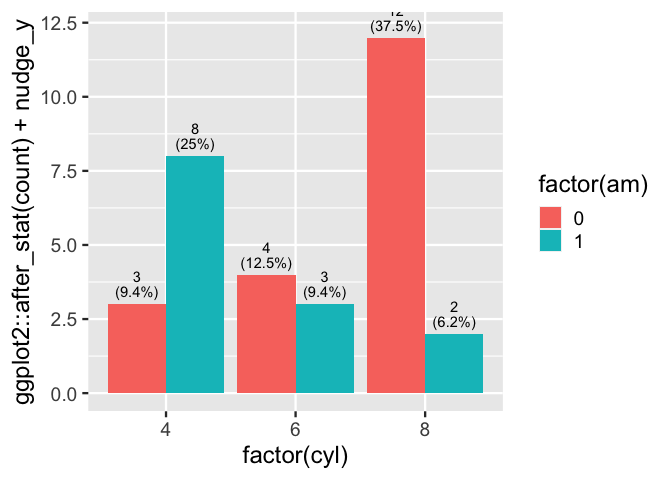

  - [ggdirect](#ggdirect)
  - [Problem:](#problem)
      - [bar charts are ubiquitous and can quickly communicate
        information.](#bar-charts-are-ubiquitous-and-can-quickly-communicate-information)
      - [bar plots can benefit from specificity of
        labeling](#bar-plots-can-benefit-from-specificity-of-labeling)
      - [but its a pain](#but-its-a-pain)
      - [or use verbose afterstat…](#or-use-verbose-afterstat)
      - [Proposed User interface](#proposed-user-interface)
      - [Composing functions](#composing-functions)
          - [geom\_text\_count](#geom_text_count)
          - [Try it out](#try-it-out)
          - [geom\_text\_count\_percent](#geom_text_count_percent)
          - [Try it out](#try-it-out-1)

<!-- README.md is generated from README.Rmd. Please edit that file -->



# ggdirect

<!-- badges: start -->

<!-- badges: end -->

# Problem:

## bar charts are ubiquitous and can quickly communicate information.

``` r
library(ggplot2)
theme_set(theme_gray(18))
ggplot(mtcars) + 
  aes(x = am) + 
  geom_bar() 
```



``` r

p <- last_plot()
```

## bar plots can benefit from specificity of labeling

Labeled bar chart is all the fast communication of traditional data
vizualization with all the specificity of a table.

## but its a pain

either precalc…

## or use verbose afterstat…

``` r
layer_data(last_plot(), 1)
#>    y count    prop x flipped_aes PANEL group ymin ymax  xmin xmax colour   fill
#> 1 19    19 0.59375 0       FALSE     1    -1    0   19 -0.45 0.45     NA grey35
#> 2 13    13 0.40625 1       FALSE     1    -1    0   13  0.55 1.45     NA grey35
#>   linewidth linetype alpha
#> 1       0.5        1    NA
#> 2       0.5        1    NA

# count column can be used via after_stat
p +
  geom_text(stat = StatCount, 
            aes(label = after_stat(count)), 
            vjust = -.7)
```


``` r

p + 
  geom_text(stat = StatCount, 
            aes(label = after_stat(
              paste0(round(100*count/sum(count), 1) ,"%")
              )), 
            vjust = -.7)
```


``` r

p + 
  geom_text(stat = StatCount, 
            aes(label = after_stat(
              paste0(count,"\n(",round(100*count/sum(count), 1) ,"%)")
              )), 
            vjust = -.5, lineheight = .8)
```


``` r

layer_data(last_plot(), 2)
#>         label  y count    prop x width flipped_aes PANEL group colour size
#> 1 19\n(59.4%) 19    19 0.59375 0   0.9       FALSE     1    -1  black 3.88
#> 2 13\n(40.6%) 13    13 0.40625 1   0.9       FALSE     1    -1  black 3.88
#>   angle hjust vjust alpha family fontface lineheight
#> 1     0   0.5  -0.5    NA               1        0.8
#> 2     0   0.5  -0.5    NA               1        0.8
```

## Proposed User interface

``` r
ggplot(mtcars) + 
  aes(x = am) + 
  geom_bar() 

ggplot(mtcars) + 
  aes(x = am) + 
  geom_bar() + 
  geom_text_count()

ggplot(mtcars) + 
  aes(x = am) + 
  geom_bar() + 
  geom_text_count_percent()
```

## Composing functions

### geom\_text\_count

``` r
#' geom_text_count
#' @description Add label which is the count.  Acts like geom_bar() but text label at the position of the top of the bar.
#'
#' @param nudge_y
#' @param position
#' @param ...
#'
#' @return
#' @export
#'
#' @examples
#' library(ggplot2)
#' ggplot(mtcars) +
#'    aes(x = cyl) +
#'    geom_bar() +
#'    geom_text_count(nudge_y = .5)
geom_text_count <- function(nudge_y = 0, position =
                              ggplot2::position_dodge2(width = .9,
                                                       preserve = "single"), ...){

  ggplot2::stat_count(geom = "text",
                      ggplot2::aes(label = ggplot2::after_stat(count),
                                   y = ggplot2::after_stat(count) + nudge_y),
                      vjust = 0,
                      position = position,
                      ...
  )

}
```

### Try it out

``` r
library(ggplot2)
ggplot(mtcars) +
   aes(x = factor(cyl)) +
   geom_bar(position = "dodge") +
   geom_text_count(nudge_y = .2)
```


``` r

last_plot() + 
  aes(fill = factor(am))
```


### geom\_text\_count\_percent

``` r


#' geom_text_count_percent
#' @description Add label which is the count as well as percentage.  Acts like geom_bar() but text label at the position of the top of the bar.  Percentage is calculated within facet panels.
#'
#' @param nudge_y
#' @param lineheight
#' @param position
#' @param ...
#'
#' @return
#' @export
#'
#' @examples
#' library(ggplot2)
#' ggplot(mtcars) +
#'     aes(x = cyl) +
#'     geom_bar() +
#'     geom_text_count_percent(nudge_y = .5)
geom_text_count_percent <- function(nudge_y = 0,
                                    lineheight = .85,
                                    position = ggplot2::position_dodge2(width = .9,
                                                               preserve = "single"), ...){

  stat_count(geom = "text",
             ggplot2::aes(label = paste0(after_stat(count), "\n(",

                                round(
                                  100*(ggplot2::after_stat(count))/
                                    tapply(ggplot2::after_stat(count),
                                           ..PANEL..,
                                           sum)[..PANEL..],
                                  1), "%)" ),
                 y = ggplot2::after_stat(count) + nudge_y),
             vjust = 0,
             lineheight = lineheight,
             position = position,
             ...
             )
}
```

### Try it out

``` r
library(ggplot2)
ggplot(mtcars) +
    aes(x = factor(cyl)) +
    geom_bar(position = "dodge") +
    geom_text_count_percent(nudge_y = .25)
#> Warning: The dot-dot notation (`..PANEL..`) was deprecated in ggplot2 3.4.0.
#> ℹ Please use `after_stat(PANEL)` instead.
#> This warning is displayed once every 8 hours.
#> Call `lifecycle::last_lifecycle_warnings()` to see where this warning was
#> generated.
```



``` r

last_plot() +
    aes(fill = factor(am))
```


